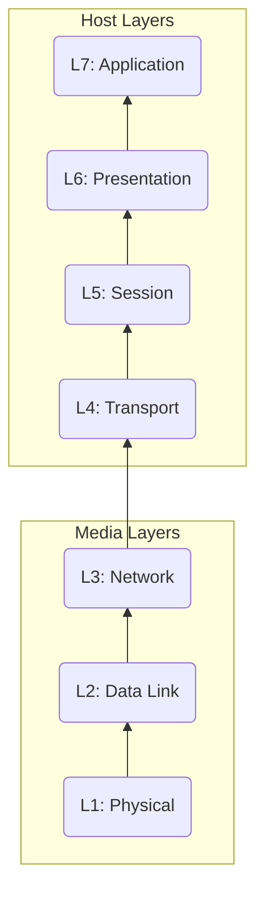

# Networking

### OSI-7 Layer Model (Networking Stack)

### Level 1: Physical
Ex: Playing a video game in 4 laptops, connected via a 'Hub'.
1. Physical shared medium
2. Only focus on **standards** for transmit to & receive from the medium
3. No data access control
4. No uniquely identified devices
5. No peer communication between devices

### Level 2: Data Link
