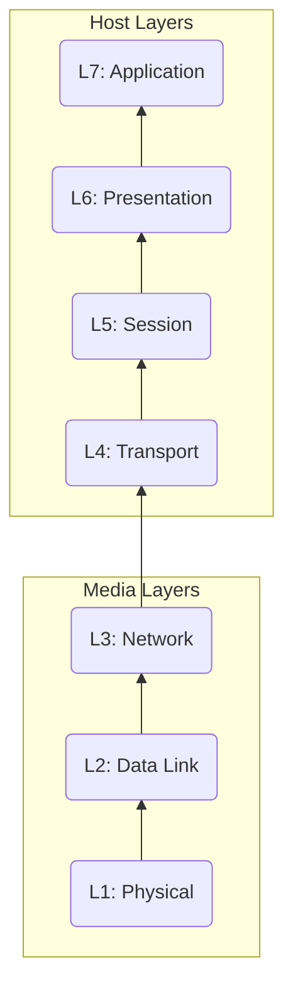

# Networking

### OSI-7 Layer Model (Networking Stack)

### Layer 1: Physical
1. Physical shared medium
2. Only focus on **standards** for transmit to & receive from the medium
3. Use hubs to connect multiple device to the same medium
4. No data access control
5. No uniquely identified devices
6. No peer communication between devices

### Layer 2: Data Link

1. Device identification via globally unique MAC addresses, which enables device to device communtication
2. Introduction of 'Frames' to transmit data via layer 1 medium.
3. Media access control to avoid collision as good as possible.
	- CSMA (Carrier Sense Multiple Access w/ Collision Detection): Identifies whether any other device in the network transmitting a signal & also detect collison and sends JAM signals.
4. Ability to detect collisions, correct them & work around them
5. Unicast communication: 1:1 communication
6. Broadcast communication: 1:M communication
7. Switches: Advanced, intelligent L1 HUBs (stores MAC addresses of the deviced connected to its' network)

### Layer 3: Network
1. Introduce of IP addresses (IPv4, IPv6), allowing cross communication via multiple layer 2 networks (Ex: LAN to WiFi)
2. Introduce of ARP (Address Resolution Protocol), which enables to find the MAC addess of a given IP to communicate with its' network.
3. Introduce the concept of route, which inform where to forward a packet to (using the destinatiob IP & Next Hop/Target IP).
4. Introduce the route tables, which contains the multiple routes so that routers can use to determine the most appropriate route to pass a packet to.
5. Introduce the device called 'Router' which basically brings a packet closer to its' intended destination.
6. Enables device to device communication where these devices reside in different local networks (LAN).
7. Cannot communicate via multiple channels between given two devices, only to source IP to destination IP.
8. Possibility of packets being delivered in out of order.

### Layer 4: Transport
1. 
